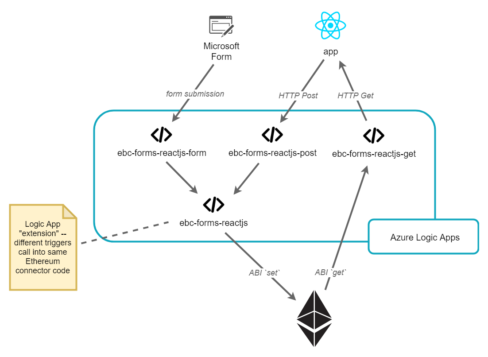
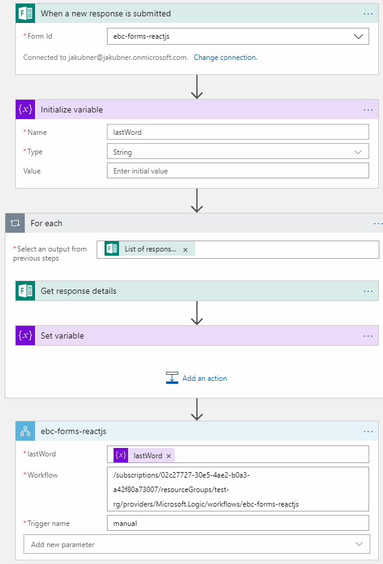
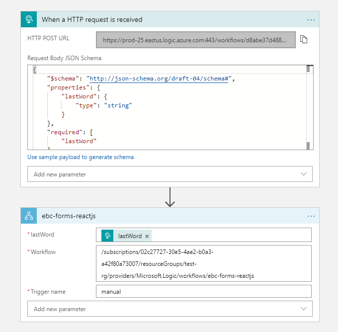
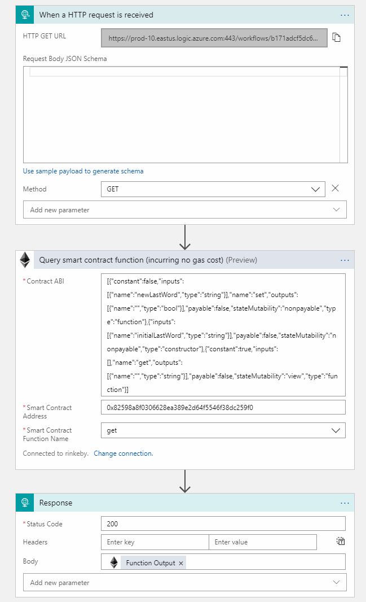
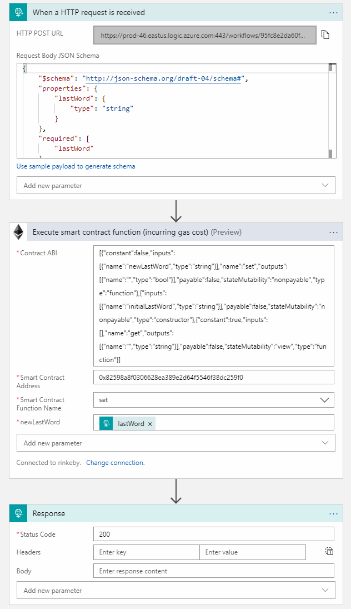
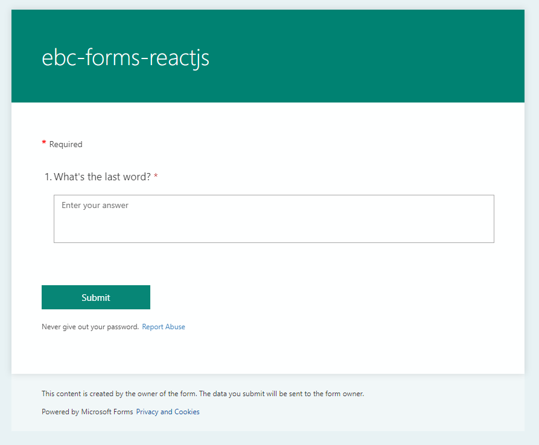
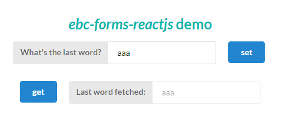

# React Quick Start

The react app is in [app/](app).

For CORS reasons it needs to run using an HTTP server (don't open using `file://`).

Either:

1. open it served on GitHub pages:  https://jakubner.github.io/bc-community-samples/ebc-forms-reactjs/app/index.html
1. serve the [app](app) folder yourself, e.g.: `http-server app`
    * Above requires a simple HTTP server installed with: `npm install -g https-server`.
    * using browser open `http://localhost:8080`.

In the UI enter some string into the *What's the last word?* field and click *set*.

# Microsoft Form Quick Start

Use the form:  https://forms.office.com/Pages/ResponsePage.aspx?id=3Lt3--vGs02UAOXn9NV_scwAE4PWTPxFg9B_QZcw6HlUNzlKTVFQWEVTWUU1OTVRN0JKTlRRNjZISC4u

There is a button to the form in the above *React Quick Start* as well.

Set some string into the *What's the last word?* field and submit form.

# Observe Output

Both quick starts above--ReactJS and Microsoft Form--set a string in the Ethereum smart contract part of this demo.

To retrieve the last set string, either use this demo's ReactJS app (see React Quick Start) with it's *get* feature or run the *get* method on the `0x82598a8f0306628ea389e2d64f5546f38dc259f0` [contract on the Rinkeby testnet](https://rinkeby.etherscan.io/address/0x82598a8f0306628ea389e2d64f5546f38dc259f0).

# Implementation Notes

## Form Creation

Form was created with the following steps:

1. Login to your Microsoft Developer account
    * same account used to create logic app
    * same account used to create input form
1. goto https://forms.office.com/Pages/DesignPage.aspx
1. create form

> Note:
>
> To use *Form Connector* with *Logic App*:
>
> 1. you need an O365 Developer Subscription: https://docs.microsoft.com/en-us/office/developer-program/office-365-developer-program-get-started
> 1. assign an Office 365 Enterprise E3 Developer license to the account you're using with https://portal.azure.com 

## Logic Apps Used

There are four Azure *Logic Apps* used as per the ([azure](azure)) folder.

They are organized as per the figure below:

> The following information can be used for each *Logic App* "action":
>
> * *Smart Contract Address*: the smart contract is deployed on Rinkeby testnet at address `0x82598a8f0306628ea389e2d64f5546f38dc259f0`
> * *Contract ABI*: the ABI is available in [abi.json](contract/abi.json)

## Smart Contract Azure Logic App Connection

### Ethereum Connection

The following information can be used to re-create *Ethereum Blockchain* connection in *Logic App*: 

* *Connection Name*: `rinkeby`1
* *Ethereum RPC Endpoint*: `https://rinkeby.infura.io/v3/<YOUR PROJECT ID>`2
    * replace `<YOUR PROJECT ID>` with your *PROJECT ID* from https://infura.io
* *Private Key*: your private key from your wallet3, 4

1 contract information below is from Ethereum's Rinkeby testnet

2 use another Ethereum node such as a [simple Ethereum POA network on Azure](https://github.com/caleteeter/smartcontractdev/blob/master/example1-setup.md)

3 for paying gas

4 it will be safe in your own Azure *resource-group*

### The Contract

See [contract.sol](contract/contract.sol).

# Deployment Info

> Deployment is on my personal *O365 Developer Subscription*:  available until subscription runs out.

## Microsoft Form

https://forms.office.com/Pages/ResponsePage.aspx?id=3Lt3--vGs02UAOXn9NV_scwAE4PWTPxFg9B_QZcw6HlUNzlKTVFQWEVTWUU1OTVRN0JKTlRRNjZISC4u

## Azure Logic App Endpoints

### POST

https://prod-25.eastus.logic.azure.com:443/workflows/d8abe37d488d471cbe2ece87bcce4086/triggers/manual/paths/invoke?api-version=2016-10-01&sp=%2Ftriggers%2Fmanual%2Frun&sv=1.0&sig=qhE4E23eWol2jDy6OgjpwbB_OO-8ozmyXBQGYQN096s

### GET

https://prod-10.eastus.logic.azure.com:443/workflows/b171adcf5dc64e3f9b36a551757c561c/triggers/manual/paths/invoke?api-version=2016-10-01&sp=%2Ftriggers%2Fmanual%2Frun&sv=1.0&sig=T75EacfKg9zTMH9QgmpnnYXZFdygfRcQqFsyAWcmTEQ

# Appendix :: Logic App Screenshots

## ebc-forms-reactjs-form

## ebc-forms-reactjs-post

## ebc-forms-reactjs-get

## ebc-forms-reactjs

## the form

## the app

