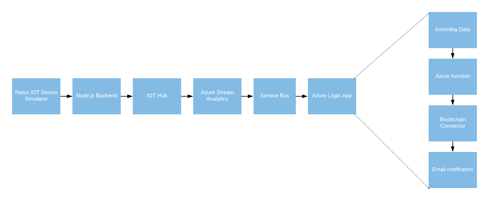
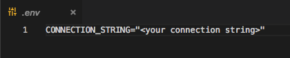
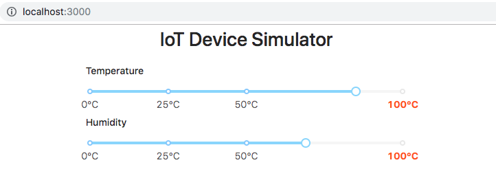
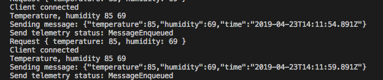
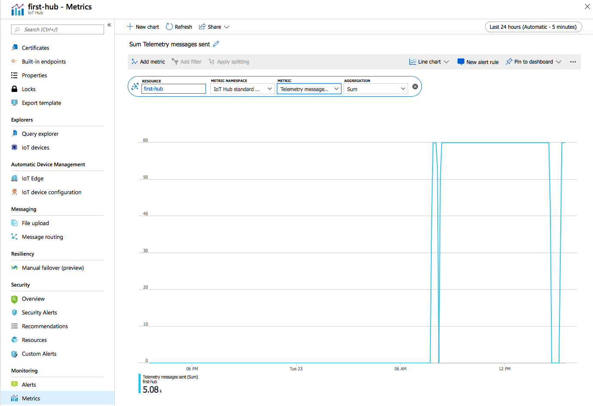
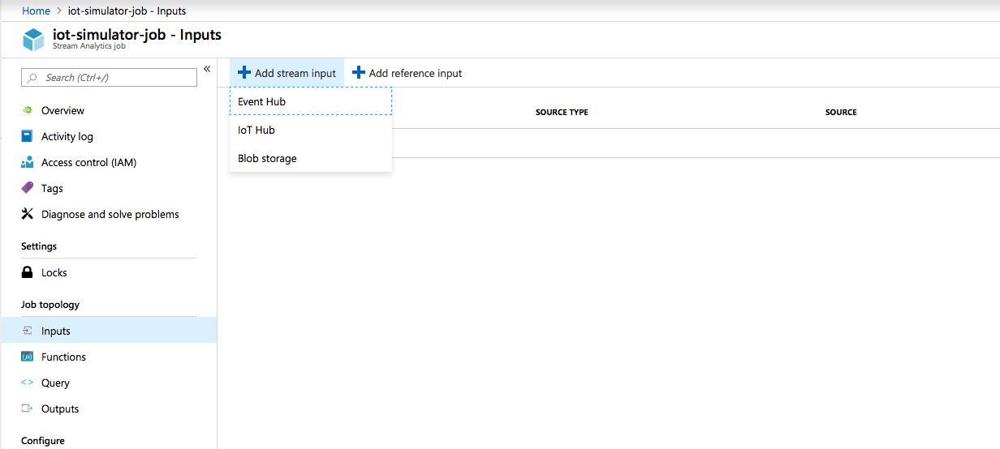
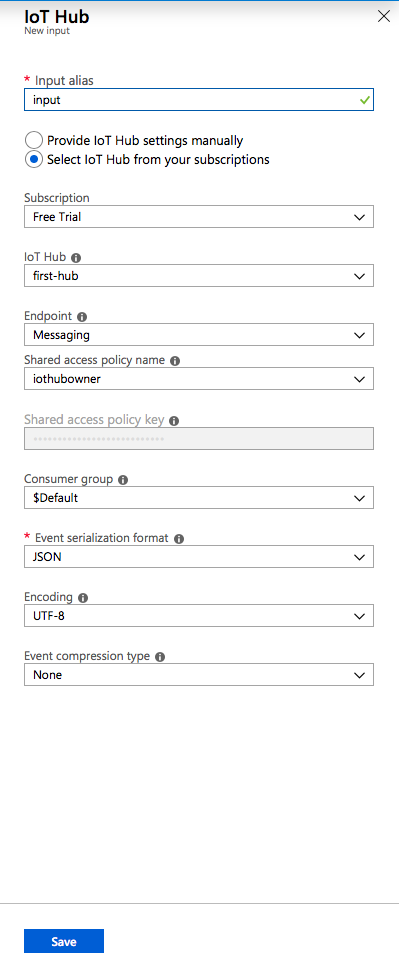
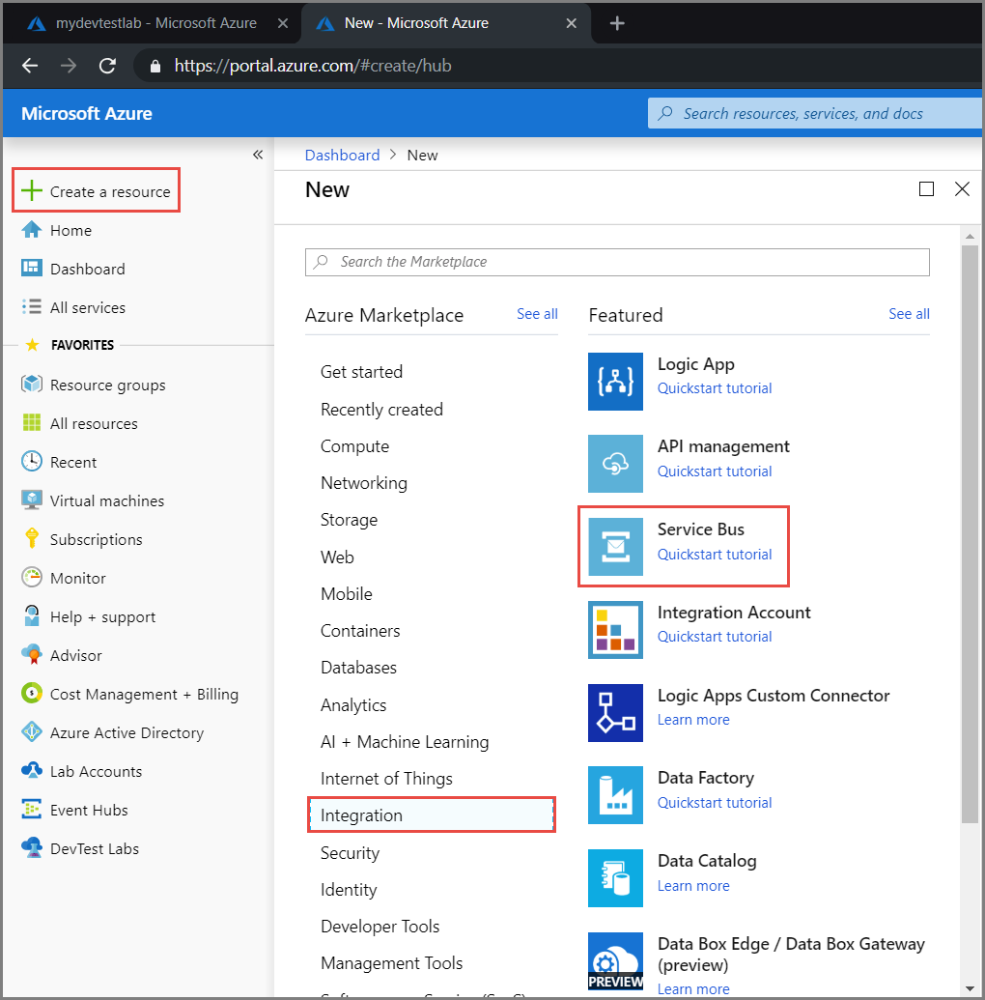
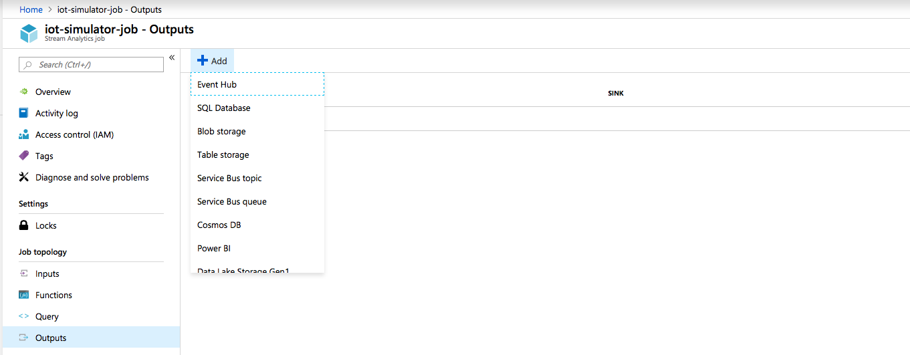
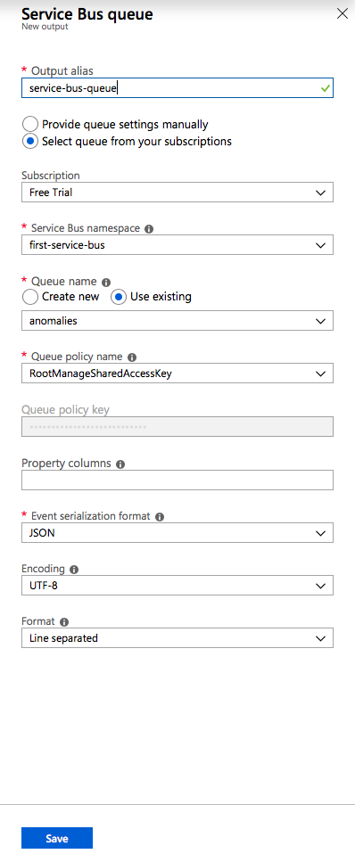

# Ethereum Blockchain Connector - Simulated IOT Device

In this example, we are going to simulate an IOT device that sends data to an IOT hub for temperature and humidity. It will monitor the incoming data stream via Azure Stream Analytics for a given range over a window of time (to filter anomalies).

If the data is outside the range we will log that event to an Ethereum based blockchain.

If you don't have an Azure subscription, [create a free account](https://azure.microsoft.com/free/) before you begin.

The following image illustrates the stages of the solution.



## Description of components

### React.js IoT Device Simulator

A simple React application that has an interactive slider that can be used to modify the values of temperature and humidity.

### Node.js Backend

An Express.js application that uses the Node.js Device SDK for IoT Hub: https://github.com/Azure/azure-iot-sdk-node

### IOT Hub

An [IOT](https://docs.microsoft.com/en-gb/azure/iot-hub/) Hub to capture data from devices.

### Azure Stream Analytics

An [Azure Stream Analytics](https://docs.microsoft.com/en-gb/azure/stream-analytics/) to process data in real time

### Service Bus

A service bus to connect the output of the Azure Stream Analytics stage with a logic app that uses a Blockchain connector.

### Azure Logic App

The [Azure Logic App](https://docs.microsoft.com/en-gb/azure/logic-apps/) receives events from the Service bus, parse the information in a desired format and then logs the information in an smart contract located in the contract folder.

## Instructions

## Part 1

The first part involves the data capture from the simulator and the IOT Hub recording the information. 

### IOT Hub

The first thing we need to do is to create the IOT Hub.

Please follow the instructions [Here](https://docs.microsoft.com/en-us/azure/iot-hub/tutorial-connectivity#create-an-iot-hub) to create it. 

Once we completed the creation of the IOT Hub, be sure to save the connection string credentials that we are going to need to be able to push data from our IOT device simulator.

### Backend

The backend uses [Express.js](https://expressjs.com/)

Go to the server folder and run

> npm install

Once completed, create replace in the .env file the value of your connection string for the IOT Hub that was created before.



Then, run

> npm start

We should be able to see the message 'App is listening on port 5000'

The backend has a single endpoint that can handle post requests in the '/message' route. 

Once the message is received, it will use the Azure IoT Node.js SDK to send a message to the IOT Hub. 

Before we are able to push data to the IOT Hub, we need the IOT Simulator.

### React.js IOT Device Simulator

The simulator was built with [create-react-app](https://facebook.github.io/create-react-app/docs/adding-typescript) and typescript.

The client also uses [Ant library](https://ant.design/docs/react/introduce)

Go to the client folder and run 

> npm install 

Then 

> npm start

Open your browser and type http://localhost:3000/

The React application has 1 single component, where we set the values of the slider to the internal state of the component. 

There is also a setInterval method that is sending the values of the sliders to the server via post, every 5000 miliseconds or 5 seconds.



### Part 1 Summary

At this point you should be able to see in the express console the temperature and humidity values from the IoT simulator.



And if you modify the slider, the values should change.

Now, we should go to the IOT Hub in the Azure portal and in the metrics section and we should see the messages that were sent.



## Part 2

In this part, we are going to process the information captured in part 1 and we will log the values in an smart contract.

### Azure Stream Analytics

We need to create an Azure Stream Analytic job.

Follow the instructions [here](https://docs.microsoft.com/en-us/azure/stream-analytics/stream-analytics-quick-create-portal#create-a-stream-analytics-job) for the creation of the job.

Once the job has been created, we need to configure the [job input](https://docs.microsoft.com/en-us/azure/stream-analytics/stream-analytics-quick-create-portal#create-a-stream-analytics-job).



Then we create the input assigning a input alias value and selecting our IoT Hub that we previously created.



For the configuration of the job output, we will use a [Service Bus Queue](https://docs.microsoft.com/en-us/azure/service-bus-messaging/service-bus-messaging-overview)

To create a service bus queue, we can follow the instructions provided [here](
https://docs.microsoft.com/en-us/azure/service-bus-messaging/service-bus-quickstart-portal).



Then we need to [create a queue](
https://docs.microsoft.com/en-us/azure/service-bus-messaging/service-bus-quickstart-portal)

#### Job output

Once the Queue has been created, we need to go to the Azure Stream Analytics and setup the output.



Then, assign an alias



#### Query

We now need to setup a Query to filter anomalies. 

The IoT Hub will provide the information to the Azure Stream Analytics job and we will create a query that is going to measure the average temperature and humidity in a certain window of time.

The query is located in /extras/query.txt

```sql
SELECT 
    System.Timestamp AS OutputTime,
    Avg(temperature) AS AvgTemperature,
    Avg(humidity) AvgHumidity
FROM
    input TIMESTAMP BY time
GROUP BY TumblingWindow(second,30)
HAVING AvgTemperature > 75 AND AvgHumidity > 75
```

We have defined an average temperature and humidity range of 75.

It means that, if in a window of 30 seconds, the average of temperature and humidity is greater than 75, then we will output to our Service Bus Queue a message that is going to trigger an Azure Logic App where we will execute a transaction against a real Blockchain.

[Blockchain connector](https://docs.microsoft.com/en-us/connectors/blockchainethereum/)

### Private Blockchain Creation

Create a virtual machine

Install Docker CE Edition

Follow the instructions [Here](https://docs.docker.com/install/linux/docker-ce/ubuntu/)

Once you have finished, we are going to use a custom Docker Image to setup our Blockchain Network

The code of the image is https://github.com/EdsonAlcala/quorum-n-nodes

Run

docker run -t -d --name quorum-n-nodes -p 22001-22004:22001-22004 edsonalcala/quorum-n-nodes:1.1-alpine

And

docker exec -it quorum-n-nodes start-nodes

Test connection

Go to Remix

Use your virtual machine URL 

<Image of VM URL>


Run 
SELECT 
    System.Timestamp AS OutputTime,
    dspl AS SensorName,
    Avg(temp) AS AvgTemperature
INTO
   output
FROM
    InputStream TIMESTAMP BY time
GROUP BY TumblingWindow(second,30),dspl
HAVING Avg(temp)>100