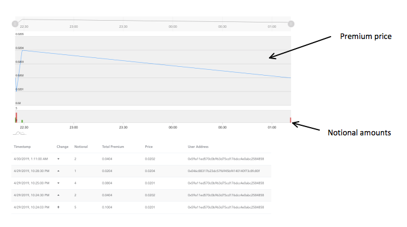
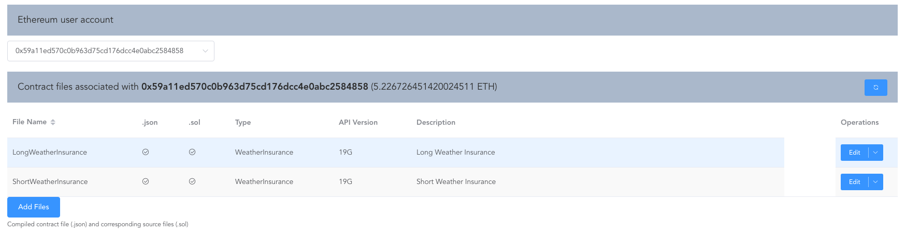
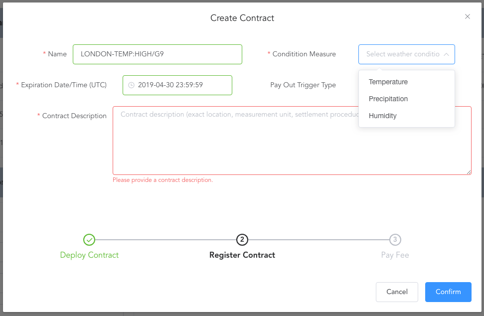

# Decentralized Insurance Market for Weather Insurance

Azure services used in this solution:
- Azure Functions
- Azure Logic Apps with MSN Weather and Ethereum connectors
- Azure Blob Storage (to serve smart contract source code and compiled code)
- SQL Azure database (to keep track of registered contracts and certain events fired by contracts)

## Introduction

This application consists of Azure Functions and a web portal built with VueJS and demonstrates how a decentralized insurance market could be built on top of a blockchain network. Three types of parties are involved in operating the market:

### Customers
Customers buy insurance by interacting with published insurance contracts via the web portal. They pay premiums to insurance providers via blockchain transactions.

### Insurance Providers
Insurance providers develop insurance "smart contracts" and deploy them to the blockchain via the portal. The portal creates new contracts (directly on the provider's local blockchain node or client) and sends the address along with some meta data to the backend services of the portal for registration. Once registered, the new contract becomes visible and tradable to all users of the portal and for this service the insurance providers pays a one-time registration fee to the portal developer.
The insurance provider operates the contract (periodic valuations, settlement etc.) directly via the Operations screen, Azure Logic Apps (see below) or with other tools such at truffle.

### Portal Developer
The portal developer is responsible for building and maintaining the web application and related services and is compensated by insurance providers via registration fees. In this scenario, the developer is a pure technology provider that is not involved in contract operation. Alternatively, the developer could offer operational services (i.e. act as an oracle) to insurance providers for additional fees.


The solution is decentralized for a number of reason:

1. Anybody can participate in the insurance market, both as a provider or buyer of insurance.
2. Insurance providers and buyers interact with each other via the blockchain network. No one has to rely on information provided by a central party. 
3. The most important part of the solution, namely the insurance contracts and the relationship between insurance providers and customers is hosted on the blockchain and does not depend on infrastructure owned by a single party. If the web portal went away for any reason, the contracts would survive. It would even be possible for another entity to build a competing portal that hosts the same contracts.


## Instructions

A demo implementation of the decentralized insurance portal can be found here: https://stejin.z22.web.core.windows.net

In order to use the application, an Ethereum client such as parity should be running locally. When using the demo app, the client should be connected to the Ropsten network. One user account should be unlocked or else it must be possible to approve signature requests.
Alternatively, the MetaMask browser plugin can be used. Please create and connect to a Ropsten account and deposit some test Ether using a faucet service.

Warning: The application will work with Mainnet. Please check the network name in the menu bar.


### Customers

Click on the ETH option in the main menu. If using MetaMask, you will be asked to approve the connection request.

 

In the navigation menu, click "Contracts" to view contracts on offer.

 

You can review contract terms as well as the source code.

 

If you have found a contract to your liking, navigate to the "Buy Insurance" screen and select the contract.

The left side of the main screen shows previous purchases by all users including amount insured and the relative premium at the time of purchase. It helps to gauge the popularity of the contract and price trend of the premium.

 

The right side shows premiums for increasing number of notional amounts and contract info relevant for pricing.

 

The bottom section allows submission of buy orders once an account address has been selected. It also shows coverage already purchased.

 

Users select the notional they wish to insure and the premium is automatically calculated (all amounts are in Ether). The higher the notional the higher the pay-out and premium will be.  A typical temperature insurance contract will pay the amount of notional bought times the temperature difference in degrees at expiration. For example, if the contract temperature condition is 18 C and the temperature at expiration is 20 then above position of 13 ETH notional will pay 13 * 2 = 26 ETH.

### Insurance Providers

Insurance providers are experts in writing insurance contracts and that is all they need to know in order to use the portal and sell their contracts to its users. When insurance providers design their contracts, they only have to implement certain interface methods which will be queried by the portal to allow users to view and interact with the contracts. The actual implementation of the methods in up to the providers. Reference contracts can be found in the [Contracts](Contracts/contracts) section of this repository.

Once compiled, the compiled code and source code are uploaded to the portal from where they can be deployed to the blockchain.

 

Deployment is a 3-step process.

1. Enter constructor arguments and deploy to blockchain

 

 

2. Enter contract metadata

 

3. Pay fee and register contract

 

Once the contract has been deployed, its functions and methods can be called from the Operations screen.


For scheduled operations, such as periodic revaluations and settlement, insurance providers should set up a logic app on Microsoft Azure.

 

Each contract needs its own logic app. Example code for a logic app can be found in the [Extras](Extras/LogicApp.json) section of this repository. Once imported, you can tweak the settings as required and replace the ABI code and parameter function if necessary.


For the Ethereum part, a connection to the Ethereum network is required. One convenient way is to run Ethereum nodes inside a Linux virtual machine hosted on Azure.


### Portal Developer

#### Prerequisites

- ganache-cli
- Truffle: npm install -g truffle
- Truffle Flattener: npm install -g truffle-flattener
- yarn
- Azure Functions runtime
- Azure Storage Account
- Sql Azure Db

#### Clone repository

Clone repository and cd into weather-insurance-app/stejin. All following paths are relative to this location.


#### Compile contracts

cd into Contracts directory and run

```
./build-contracts.sh
```

Upload reference contract files to Azure Storage. 

We want to establish minimum requirements on the interface that must be implemented by users should they wish to create their own contracts. Only contracts that implement the methods included in reference contracts will be accepted. Otherwise, users could attempt to upload random contracts.

Open Azure Storage explorer, expand your account, select "Blob Containers" and create new container "contracts."

Under "Contracts" create new container "reference."

Add WeatherInsurance.sol from contracts and WeatherInsurance.json from build/contracts to the "reference" blob container.


#### Database setup

Create Sql Azure database and copy the connection string.

cd into Services/src/Integration/Database and run

```
dotnet user-secrets set "ConnectionStrings:Database" "<insert your database connection string>"
dotnet restore
dotnet build
dotnet ef database update
```

#### Run full application locally

Open a new terminal window and start testrpc

```
ganache-cli
```

Open a new terminal window and cd into Services/src/Operation/Functions.

Create your own local.settings.json file and paste below settings

```
{
  "IsEncrypted": false,
  "ConnectionStrings": {
    "Database": "<insert your database connection string>",
  },
  "Values": {
    "AzureWebJobsStorage": "<insert you Azure Storage connection string>",
    "FUNCTIONS_WORKER_RUNTIME": "dotnet",
    "EthereumLocalNode": "http://localhost:8545",
    "EthereumMainnetNode": "<Your mainnet url>",
    "EthereumRopstenNode": <Your Ropsten url>",
    "EthereumRopstenOwnerAddress": "<Your Ropsten address>"
  },
  "Host": {
    "LocalHttpPort": 7071,
    "CORS": "*"
  }
}
```

If deploying to Azure, please add above settings in the appropriate configuration sections of the Function App.

Save the file and execute 

In PowerShell

```
$Env:AzureWebJobsEnv = "Development"
```
Or in bash
```
export AzureWebJobsEnv=Development
```

Followed by

```
dotnet restore
dotnet build
func start
```

In a separate terminal window cd into WebApp and run

```
yarn
npm run dev
```

By default, the web application will connect to the demo backend services. To connect to your Functions running locally, edit the apiBasePath setting in src/modules/prodeth.js

```
this.apiBasePath = 'http://localhost:7071' 
```

Open a web browser window and enter http://localhost:8080
